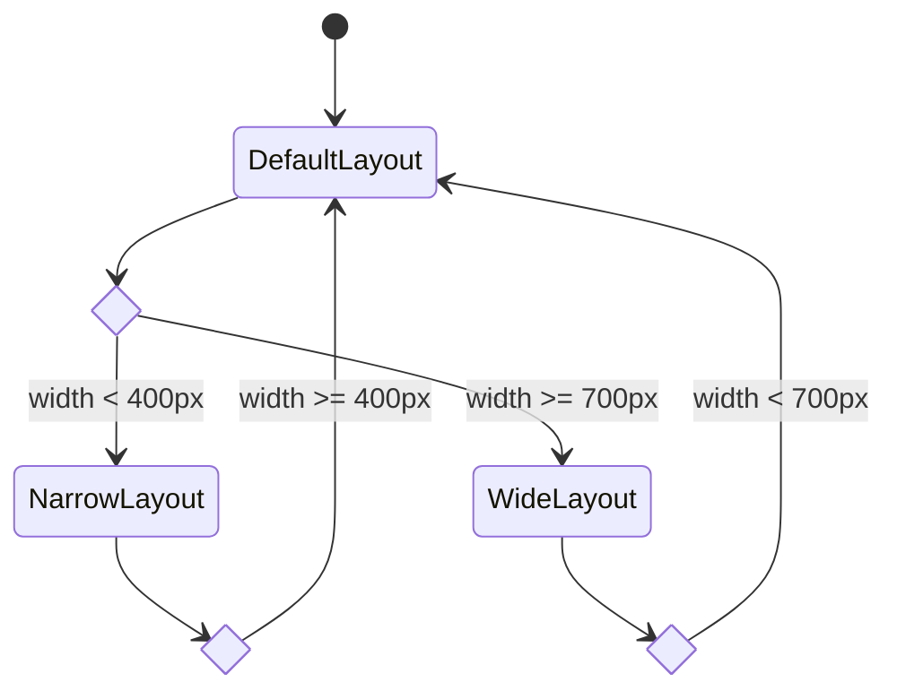

# Dashboard.NET

Dashboard.NET is a commandline application similar to [wtfutil](https://wtfutil.com/) but built on [dotnet](https://dot.net) with [spectre.console](https://spectreconsole.net).

---

## Installation

### TODO: Windows

### TODO: Linux

## Commands

- dash
  - config
  - weather
    - get  `[FORECAST]`

- stocks

## UI

### Dashboard

**Command**: `dash board`

- The dashboard is the main window of the program.
- A dashboard is made up of multiple panels which represent a module/service.
- The dashboard monitors console width and rearranges its internal panels based

#### dashboard Layout

